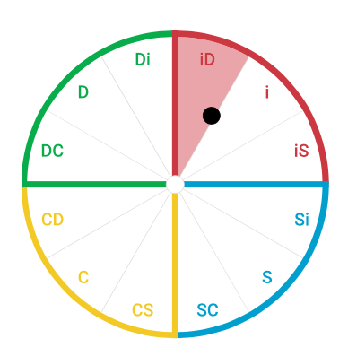

# readme

who's Gus?
And the best way to work with me.

## at RDC

I'm a **Principal Software Engineer** in the `Content` Community.

I report to Tracy Ferguson.

Here's where I [sit in the ORG](https://realtor.workplace.com/work/org/100063142959356?ref=profile_cover_button)

## Gus' DISC style

[What is DISC?](https://www.discprofile.com/what-is-disc) DiSC® is a personal assessment tool used by more than one million people every year to help improve teamwork, communication, and productivity in the workplace.

### Gus's Overview

My DiSC® Style: `iD`



Because you have an iD style, Gus, you’re probably a **goal-oriented** person who seeks exciting breakthroughs. Most likely, you want to have the freedom to set your own course. You may be **fairly ambitious**, and you’re probably **attracted to high-profile assignments** that will allow you to **maximize your talents**.

Most likely, you’re **passionate and expressive**, and your enthusiasm may be contagious. You probably have a self-assured attitude that many people are drawn to. You may use **gestures and anecdotes** to emphasize your points, and you tend to speak freely with little concern about filtering your thoughts.

You probably show an ability to persuade others to adopt your vision. More often than not, your persuasive powers allow you to work toward your goals by gaining the **buy-in of others**. However, people who are more analytical may challenge some aspects of your plans that you have left unaddressed. While you’re able to **create forward momentum** in a group, you may prefer to **delegate more in-depth responsibilities** to others.

Like others with the iD style, you’re probably **active and energetic**. Because you prefer variety, you like to have multiple projects on your plate, and you may **dislike sitting still for long periods** or being forced into monotonous routines. You enjoy the gratification of **kicking off a new project**, but after the excitement wears off, your interest may wane.

Because you enjoy having **influence**, you may strive to be among the inner circle in an organization. Most likely, you **want to be heard**, and you do your best to make a favorable impression. You appreciate being recognized for your contributions, and you’re unlikely to be embarrassed by public recognition. And, because you value such compliments, you may be **generous with your praise of others**.

Most likely, you **enjoy meeting new people** and building on your large network of friends and associates. You’re probably fairly open to sharing personal information, even with people you’ve just met. Because you enjoy making connections, you’re happy to **introduce people** who may have common interests. Furthermore, you may embrace opportunities for **friendly banter or brainstorming**.

When conflict arises, you probably try to **focus on the positive**. In fact, you may even try to brush unpleasant issues under the rug for as long as possible. However, if things become heated, you’re more likely to express your feelings than to shut down. While venting your emotions may seem cathartic to you, it may make others around you uncomfortable.

You’re probably **not afraid of the unexpected**, and you may enjoy the excitement of being spontaneous. Because you’re fairly adventurous, you tend to seize new opportunities, even if it means changing directions. You’re open to **taking risks** and making decisions based on your gut instinct. Because you can be overly optimistic at times, you may dismiss potential obstacles too quickly.
Gus, like others with the iD style, `your most valuable contributions to the workplace may include your ability to initiate change, your passion, and your drive toward results.` In fact, these are probably some of the qualities that others admire most about you.

## WHAT PRIORITIES SHAPE YOUR WORKPLACE EXPERIENCE?

### Taking Action

Gus, you like to act fast and keep moving so that you can make quick **progress**. Hesitancy may frustrate you, and you grow impatient if rules or procedures threaten your rapid pace. Furthermore, you’re probably more adventurous than most people, so you aren’t afraid to take chances in the interest of saving time. Your focus on taking action can help the group get things done as quickly and efficiently as possible.

### Generating Enthusiasm

People with the iD style tend to be optimistic, even when faced with adversity. You probably feel that **staying upbeat** prevents you from losing momentum. Furthermore, your passion often inspires people to share your excitement. Most likely, you have a knack for persuading people without coming across as pushy. Because you enjoy getting everyone on board, you focus on generating enthusiasm.

### Getting Results

Like others with the iD style, you tend to be ambitious and focused on innovation. You’re probably willing to take short-cuts and risky leaps if they could yield bigger, more immediate payoffs. Furthermore, you often set the bar high and won’t settle for minor victories. You’re focused on contributing to the team’s success by implementing your ideas rapidly and **getting results**.

### Offering Challenge

Although it’s somewhat unusual for someone with the iD style, you’re probably willing to **ask questions and challenge assumptions** when presented with new ideas. You place a high value on **competency**, and when you spot a flaw, you’re likely to speak up about it. Furthermore, if you encounter methods that you think lack common sense or a logical basis, you probably make others aware of your discomfort.

## WHAT MOTIVATES YOU?

Different people find different aspects of their work motivating. Like other people with the iD style, you’re probably attracted to projects that are adventurous and colorful. Most likely, you enjoy creative and energetic team environments where you can use your passion and charisma to lead the group toward major accomplishments. However, you may also appreciate an environment where you can ask tough questions and challenge assumptions, and this is less typical of the iD style.
You probably enjoy many of the following aspects of your work:

- Developing new relationships
- Persuading others
- Initiating colorful projects
- Achieving immediate results
- Creating enthusiasm and momentum
- Working toward challenging goals
- Inspiring others to do their best
- Asking meaningful questions
- Bringing inefficiencies to attention

## WHAT IS STRESSFUL FOR YOU?

Then there are those aspects of your work that are stressful for you. Because you tend to maintain an energetic pace and strive for quick results, you may find routine work to be draining. Consequently, you may be more interested in starting new projects than following through on old ones. Furthermore, you may dislike it if you have to rein in your innovative plans because the organization has different priorities. At the same time, unlike others with the iD style, situations in which you’re expected to accept things at face value may be difficult for you.
Many of the following aspects of your work may be stressful for you:

- Sustaining interest in routine projects
- Having to moderate your pace
- Partnering with overly cautious people
- Following strict rules or protocols
- Working steadily toward long-term goals
- Setting realistic limits
- Using a slow, systematic approach
- Dealing with people who don’t meet your standards
- Having to keep your opinions to yourself

## Social Media (RDC)

- workplace: https://realtor.workplace.com/profile.php?id=100063142959356
- enterprise github: https://github.move.com/glopezorozco?tab=repositories
- confluence: https://moveinc.atlassian.net/wiki/spaces/~617551133/overview
- linkedIn: https://www.linkedin.com/in/gustavoalopez/

### Gus' CV - About

Hands-on Technology Leader / Innovator with **over 25 years** of experience in delivering highly challenging IT projects for multiple industries in North America, South America, Europe, and Australia.

Gus has proven **people leadership** & management skills, love of **public speaking**, and a track record for accomplishing **technically challenging projects** by guiding a team of highly talented individuals.

Gus also possesses hands-on experience in start-up and incubators within large enterprises.

Having a **Master’s degree** from RICE University’s prestigious Computer Science program, an **MBA** from Melbourne Business School and a **PhD** with summa cum laude distinction (Data Science), Gus has a unique blend of highly technical and business skills.

His passion and key motivators are using data to **inform decisions**, **improve processes** and create a **competitive advantage** for organizations. This has enabled the organizations where Gus has worked in to experiment, understand the customer’s needs faster, and know with which speed to enter, stay or leave a market.

### Core Strengths / Skills:

- Software (Cloud, Web and Mobile) best design patterns and practices.
- Agile methodology and development practices.
- Lean start-up and incubator experience.
- Business development.
- Stakeholder engagement.
- Hiring, retaining, & growing talent.
- Inspirational leader and speaker.

## Complements in the past

```
Software development is like a giant invisible Jenga tower. It requires way more than the ability to craft code. Being able to see the direction which the Jenga tower is leaning to and the pieces to move is truly invaluable. The unfortunate reality is that developers struggle do that. Most don’t even see the “tower”. Now, add to that, having to explain to product owners, clients and new comers and work colleagues what the heck is going on.
Gus is a Jenga tower master. His ability to navigate through systems complexity, grasp the problems, figure out solutions, implement them and explain it all to people, in a nice and chilled way, is unparalleled. Gus is an IT shaman, he’s an expert in telling stories that carry the value forward and enable good deliveries.
Having Gus in a team is certainty of great code, sensible architectures and good laughs. I seriously hope I get to work with Gus on daily basis again.
```

```
Gus’ ability to dissect and understand complex distributed systems and explain them to others in simple terms is second to none. Gus is also gifted with great people skills, easily building relationships and bringing teams together. With his top-notch tech and people skills, Gus is fantastic at gathering feedback to try and improve systems and processes. Add to that some creative, out-of-the-box thinking and you’ve got yourself a top asset when it comes to rallying the troops and tackling particularly thorny problems !
```

```
Gus is an incredibly intelligible and engaging presenter. I attended Gus' BigQuery/SQL workshop at REA Group recently, leaving the session with a lasting impression; it was easily the best data workshop I have attended—ever. Gus distilled high-level concepts right through to nitty-gritty in a way that made me not want to blink/miss a moment, because I was so focused, intrigued and wanted to sponge the knowledge, hands-on tips/activities, and of course the jokes. If anyone can make data fun, it's Gus!
```

```
I first hired Gustavo in 1999, and since then I've relied on him for roles ranging from database analyst, lead developer, and technology consultant.

In technology hiring, we are often forced to choose between a pure coder, business analyst, or strategist/manager. Gustavo brings all three, making him effective at multiple layers of the organization (in the code, on the whiteboard, and in the board room).

Also, he is dedicated, smart, and outrageously fast. For these reasons, and because he is a pleasure to work with, he is a precious gem for any company lucky enough to snag him
```
